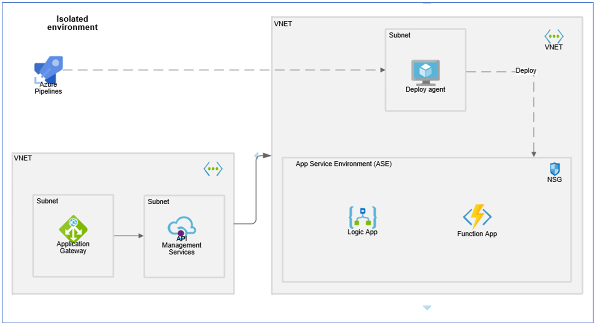

# Azure-ASEv3-Terraform

- [Azure-ASEv3-Terraform](#azure-asev3-terraform)
  - [Introduction](#introduction)
  - [pre-requisites](#pre-requisites)
  - [How to use](#how-to-use)


## Introduction

The repo contains reusable Terraform code to deploy Azure ASEv3 for Azure Integration Projects based on the below architecture



## pre-requisites

- Bash
- Terraform 1.3.0+
- Azure CLI
- Authenticated connection to Azure, using Azure CLI

  ```bash
  az login --tenant <TENANT_ID>
  ```

- GitHub Repo
- A GitHub PAT token (full scope) for the relevant repo

## How to use

clone the repo from develop branch

  ```bash
  git clone -b develop git@github.com:sysco-middleware/Azure-ASEv3-Terraform.git
  ```

You can use the `Dockerfile`to build a container with all required softwares installed (Terraform, Azure CLI.,) or install all the softwares on your system manually

If using `Dockerfile`, you can mount the working directory to container and work on it

```bash
# Build the image
docker build -t azure-sre .

# Run docker container with `SRE-Kubernetes` directory mounted as volume
docker run --rm -it -v "$PWD/azure-terraform:/root/azure-terraform" --name azure-terraform azure-sre
```

Authenticate to use Azure CLI

```Bash
az login --tenant <TENANT_ID>
```

Select the correct subscription to deploy the resources

```Bash
az account set --subscription <SUBSCRIPTION_ID>
```

Update the variables file

```bash
cp quistart-variables.example terraform.tfvars
vi terraform.tfvars
```

Run Terraform

```bash
terraform init
terraform validate
terraform plan -out plan.out
terraform apply plan.out
```

